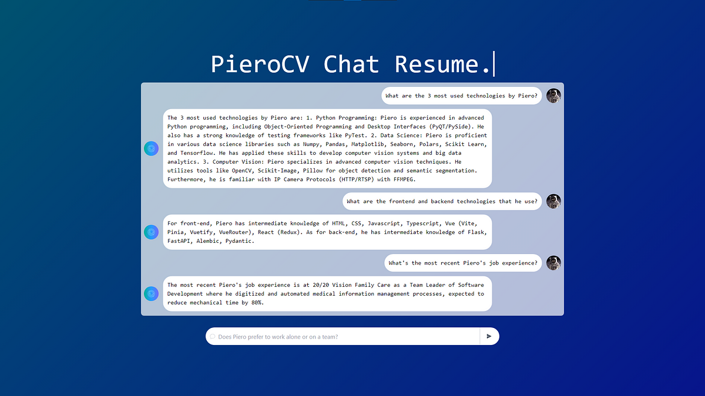

# Chatbot Portfolio Frontend
This is the frontend of the portfolio project **Chatbot Portfolio**. It uses VueJS3, Tailwind and Vite for the development.

<p align="center">
  
</p>

This frontend is a single page application for the chatbot app. It has a simple text input and chat output for the results. 
<p align="center">
<strong>You can test it <a href="https://chatapp.intautomation.net">Here!</a></strong>
</p>

Read the article attached [here](#).

## Implementation Disclaimer (**Important!**)
After the release of Open AI GPT's, this client was modified to send a custom response redirecting to the new custom GPT in order to save cloud resources. 

## Instalation
This section shows the process to install the client.

### Core Installation
1. This application was tested with Node v20.9.0 and npm v10.1.0. However, you could use the package manager you consider it's okey.

2. After cloning the repository and entering the project folder, it's simple to install the packages. Using NPM:

```bash
npm install
```

3. Finally, you can test the application using bash command.
```bash
npm run dev
```
And open `http://localhost:3000`.

### Deployment
4. If you want to deploy this client, an nginx config file is provided linked to a Dockerfile in order to a container be created.
```bash
docker build -t chatbot-frontend
```

5. Once the image is built, you can run it using the `docker run` command.
```bash
docker run -p 5173:80 chatbot-frontend
```

**Note**: This command maps the port 80 from the container to the port 5173 in localhost. In the backend project, be sure that the CORS Middleware is set to allow this port.
## Potential Improvements
- A CI/CD pipeline is always valuable. A Github action for build and host the docker image could be potentially implemented.

## Issues or Contributions
Feel free to open an issue or pull request. As is a small portfolio project, you can use the format you consider most useful. Thank you in advance!

## License
The current repository has MIT License. Please check it on the `LICENSE` file.
